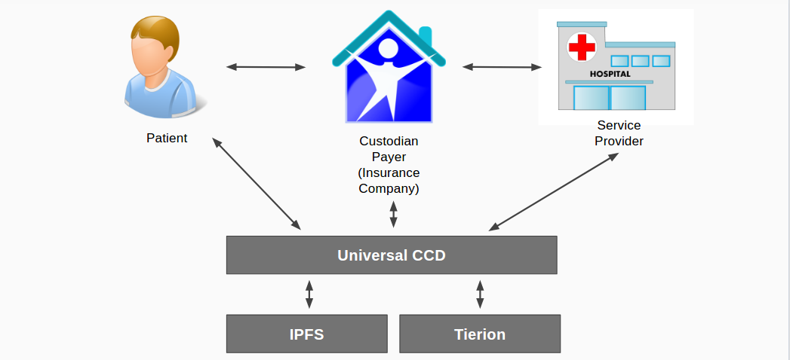

# Universal CCD
_Health System Data Integration and Integrity_

Universal CCD (Continuity of Care Document) is an electronic document exchange standard for sharing patient summary information using Blockchain technologies to provide data encryption and non-repudiation.

# Prerequisites

- [Ethereum](https://www.ethereum.org/) 
- [Tierion](https://tierion.com/) - Non repudiation system - uses Blockchain
- [Solidity](https://solidity.readthedocs.io/)
- [IPFS](https://ipfs.io/)
- [MIT Enigma](http://enigma.media.mit.edu/) (Optional)
- [Blockstack](https://blockstack.org/) (Optional)

# Design Overview

1. IPFS is used for Public Distributed Storage
    - IPFS files never go away
    - Due to this current limitation, this solution would use the Private Swarms and Private Gateways currently being developed
    - We cannot trust IPFS, so we use a non-repudiation system like Tierion
    
2. A Patient establishes a smart contract with their Payer (Insurance Company), who acts as their Custodian
    - This is akin to an Insurance Card you get today from your Insurance Company
    - The Custodian creates an empty Ledger in IPFS for the Patient
    - The hash from that Ledger file added to IPFS provides the original value in the User's digital Universal_CCD.wallet
        - The Patient's wallet also contains the Public Key of the Custodian
        - The Custodian retains the Patient's Public Key
  
3. A Patient establishes a relationship with a Service Provider (Hospital)
    - This is akin to giving them their Insurance Card
       - This includes the Patient's Public Key
       - This includes the hash (Filename) for the Patient's Consolidated CCD Ledger file in IPFS
       - This includes the Custodian's Public Key
    - The Service Provider (SP) provides the Patient with the SP's Public Key that is added to the Patient's wallet
    
4. A SP (Hospital, Clinic, Doctor, etc) contributes new CCD information for a Patient by adding the CCD into IPFS
    - The hash from the new file is added to the user's Ledger in IPFS
    - This is tracked as a Business transactions with the Custodian for the CCD addition added to IPFS using Ethereum
    - Values returned from the interactions with IPFS and Ethereum are used in a transaction with Tierion (which creates a verifiable record of any data or business process on the blockchain)
    
5. The same process as above, is used when Custodian's (most likely in a Case Management Situation) create additional data for a new CCD file.

